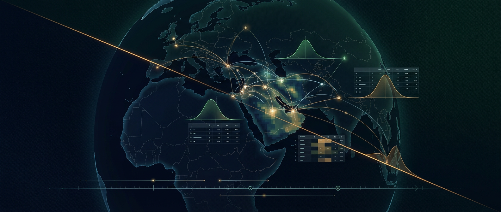

# Geopol Forecaster

A two-stage geopolitical forecasting pipeline. Given a forecast question and
live news grounding, it simulates a roster of ~40 actors deciding how they
would respond over four timesteps, then runs a six-lens analytical council
that independently answers, cross-reviews, and synthesises a final report.

Every perspective is published — per-actor trajectories, per-turn world
states, lens answers, cross-reviews — alongside executive-briefing and
full-archival PDFs.

- **Published runs**: https://danielrosehill.github.io/Geopol-Forecaster/

## Pipeline

1. **Stage A — actor simulation.** A referee + per-actor loop inspired by
   IQTLabs' [snowglobe](https://github.com/IQTLabs/snowglobe)
   (`examples/ac_sim.py`). Every actor commits privately and independently;
   the referee narrates the world state between turns using
   authority-precedence conflict resolution. Actors see only the
   referee-authored state and their own private memory.
2. **Stage B — lens council.** Six lens directives (neutral, pessimistic,
   optimistic, blindsides, probabilistic, historical) deliberate via
   karpathy's [llm-council](https://github.com/karpathy/llm-council) 3-stage
   protocol — parallel query → blind peer review → chairman synthesis — with
   a frozen bundle of base context + Tavily/RSS/ISW fresh data + Stage A's
   simulation summary. The chairman writes the final report directly.

Grounding is a frozen bundle — no per-actor re-searching — so every member
of the ensemble reasons from an identical world state.

## Running

```bash
uv sync
cp .env.example .env     # fill in OPENROUTER_API_KEY and TAVILY_API_KEY
uv run geopol smoketest
uv run geopol forecast "Will the April 2026 ceasefire hold through +1 month?"
```

Each run lands in `reports/<UTC timestamp>/` and is automatically rendered
to three PDFs and fanned out to `docs/runs/<id>/` for the Jekyll site:

- `chairman_report.md` — final synthesised forecast
- `intel_report.pdf` — executive briefing (~15 pages: cover + BLUF + chairman + colophon)
- `full_transcript.pdf` — archival (~300+ pages: every actor, turn, lens, review)
- `combined_report.pdf` — briefing + archival merged
- `fresh_data.json` — frozen Tavily + RSS/ISW bundle
- `simulation.json` — full Stage A transcript
- `stage1_answers.md`, `stage2_reviews.md` — council trace

## Layout

```
geopol/
  config.py          Models, MC runs, paths.
  llm.py             OpenRouter async client.
  base_context.py    Static conflict background.
  schemas.py         Pydantic schemas.
  news/              RSS + Tavily + frozen fresh-data bundle.
  actors/            Persona briefs for the simulation roster.
  simulation/        Stage A — control/player loop + summariser.
  council/           Stage B — 6 lens directives + 3-stage protocol.
  render/            Markdown → Typst source → PDF.
  pipeline.py        End-to-end orchestrator.
  cli.py             `geopol forecast` / `geopol smoketest`.
scripts/
  render_intel_report.py      Executive-briefing PDF.
  render_full_transcript.py   Archival full-transcript PDF.
  publish_run.py              Fan out a run into docs/runs/<id>/.
  webui.py                    Stdlib web UI for submitting prompts.
```
